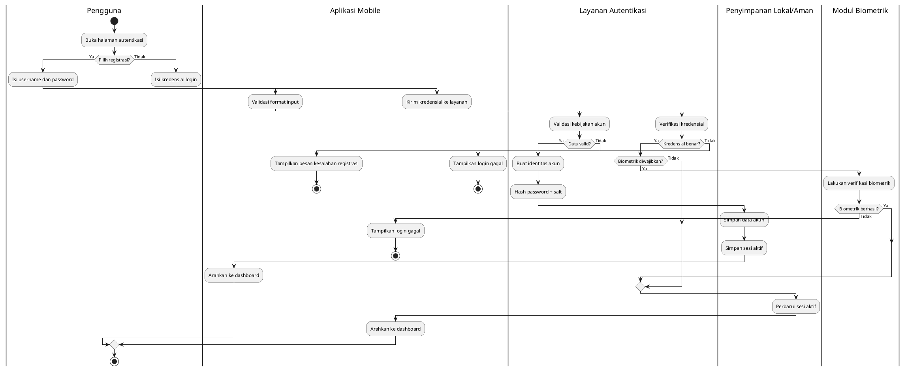
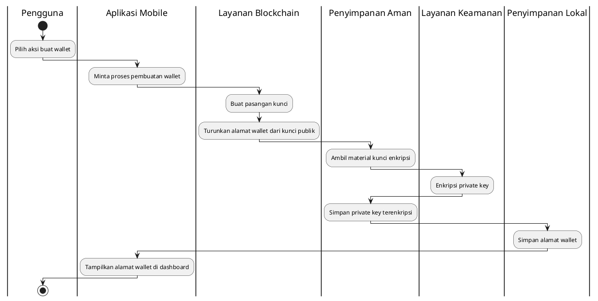
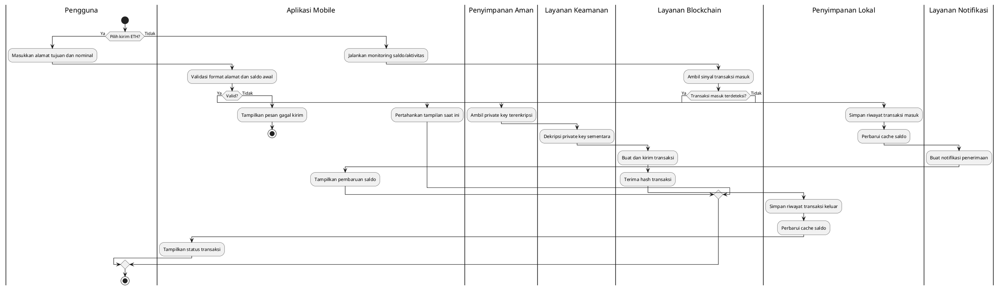
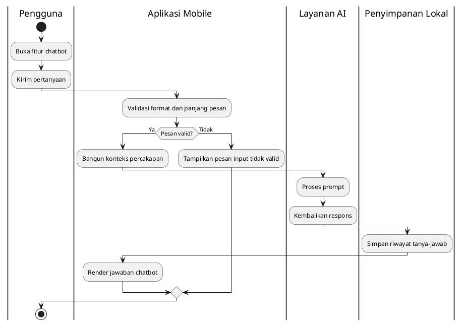
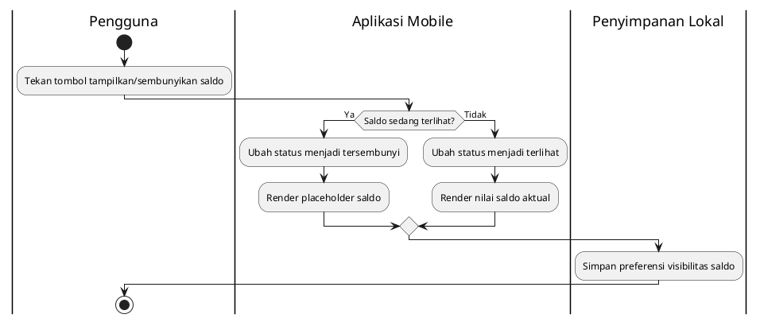
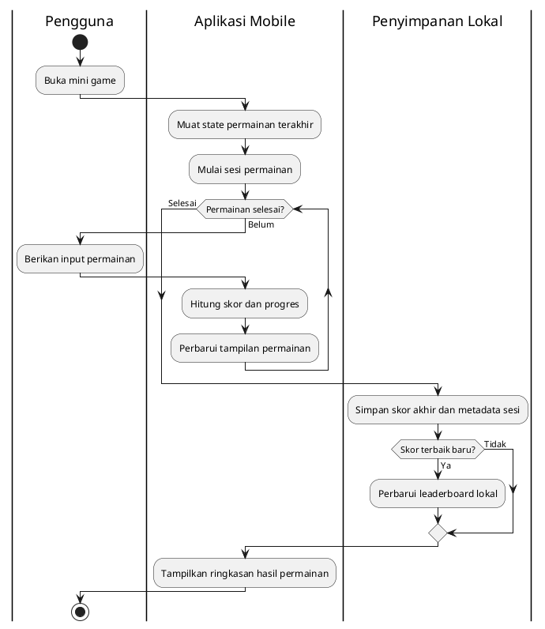
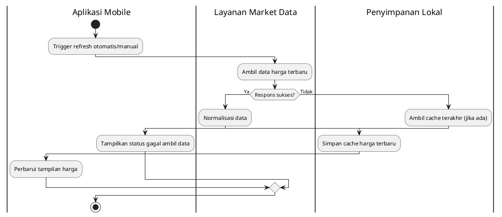
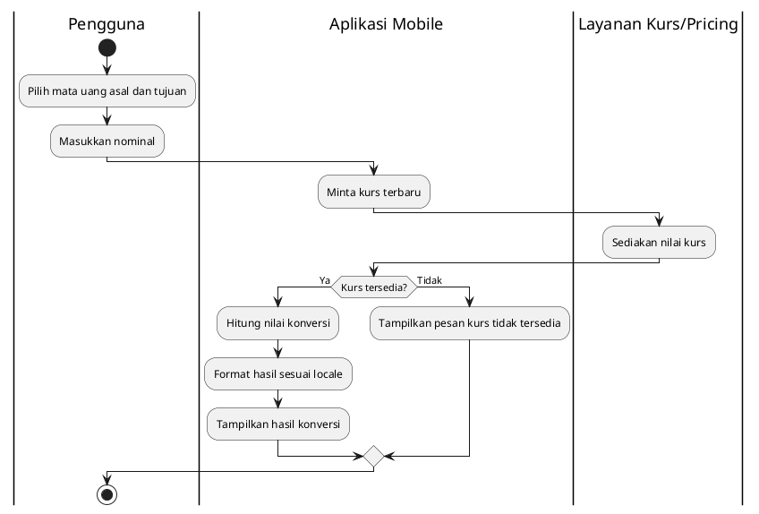
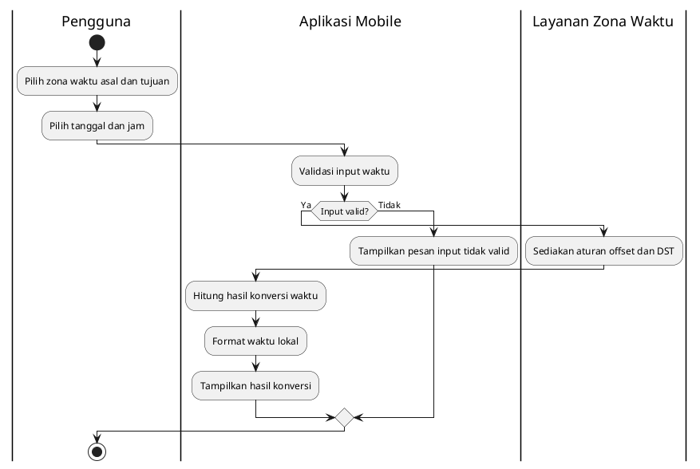
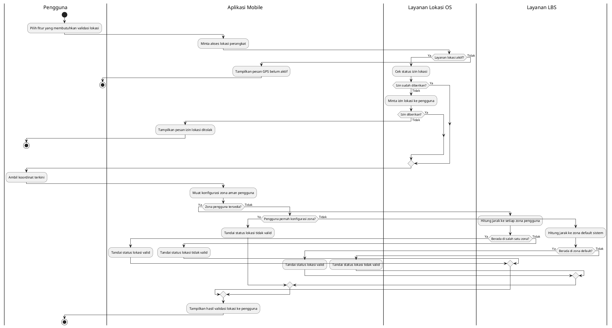

# Diagram Aktivitas Per Fitur (Bahasa Indonesia) - Versi Swimlane

Dokumen ini berisi activity diagram per fitur menggunakan swimlane (partisi) agar peran aktor lebih jelas.

## 1) Registrasi dan Login

## 2) Generate Wallet dan Enkripsi Private Key

## 3) Kirim dan Terima ETH

## 4) AI Chatbot

## 5) Hide Saldo

## 6) Mini Game

## 7) Fetch Price

## 8) Konversi Mata Uang

## 9) Konversi Waktu

## 10) LBS (Location-Based Service / Safe Zone)

