# NexusNode Lite: Low-Level Data Flow + UML

This document is grounded on the current implementation in this workspace.

## PART 1 - Low-Level Data Flow Demonstration

---

## 1) USER AUTH & SESSION SERVICE

### 1.1 Step-by-step flow (Register -> Session -> User-scoped storage)

1. UI collects `username`, `password`, `enrollBiometric` in `RegisterScreen._register()`.
2. `AuthService.register()` validates input length and uniqueness.
3. `PasswordService.generateSalt()` creates random 32-byte salt (base64).
4. `PasswordService.hashPassword()` derives PBKDF2-HMAC-SHA256 hash (`100000` iterations, 256-bit output).
5. Optional biometric enrollment via `BiometricAuthService.enrollBiometric(userId)`.
6. `UserAccount` object is stored in Hive `accounts` box keyed by `userId`.
7. Active session is written to secure storage key `active_user_id`.
8. UI opens user-scoped Hive boxes via `UserScopedStorage.openForUser(userId)`.
9. Blockchain context is bound via `BlockchainService.setActiveUser(userId)`.

### 1.2 Dart snippet (from implemented architecture)

```dart
final result = await auth.register(
  username: _usernameController.text.trim(),
  password: _passwordController.text,
  enrollBiometric: _enrollBiometric,
);

if (result.success) {
  ref.read(currentUserProvider.notifier).state = result.user;

  final storage = ref.read(userScopedStorageProvider);
  await storage.openForUser(result.user!.id);

  final blockchain = ref.read(blockchainServiceProvider);
  blockchain.setActiveUser(result.user!.id);
}
```

```dart
// AuthService.register core
final userId = _uuid.v4();
final salt = _passwordService.generateSalt();
final passwordHash = await _passwordService.hashPassword(password, salt);

await _box.put(userId, account.toMap());
await _setActiveUser(userId); // secure storage: active_user_id
```

### 1.3 Simulated terminal/log output

[STEP] RegisterScreen: submit username=alice, enrollBiometric=true
[STEP] AuthService.register: validating input
[STEP] PasswordService.generateSalt: produced 32-byte salt (base64)
[STEP] PasswordService.hashPassword: PBKDF2-HMAC-SHA256 iterations=100000
[STEP] BiometricAuthService.checkAvailability: canAuthenticate=true, hasEnrolled=true
[STEP] BiometricAuthService.enrollBiometric: keyAlias=nexus*user*<uuid>
[STEP] Hive(accounts).put(<uuid>, UserAccount)
[STEP] SecureStorage.write(active*user_id, <uuid>)
[STEP] UserScopedStorage.openForUser(<uuid>): open user*<uuid>\_wallet/chat/game
[STEP] BlockchainService.setActiveUser(<uuid>)

### 1.4 Raw and processed data examples

Raw input from UI:

```json
{
  "username": "alice",
  "password": "MySecurePass123",
  "enrollBiometric": true
}
```

Processed security artifacts:

```json
{
  "userId": "0c45d2d2-4f73-4ef6-a77d-9f6e9f46a2a8",
  "salt": "kRZJ6fNw3cM8h3jvY9QWf7g7mQ2H8x9eVv8LkQ==",
  "passwordHash": "i5qkM8u8x6Q5k2fQf0yW7D6x5v4r3t2s1p0n...",
  "biometricPublicKey": "MFkwEwYHKoZIzj0CAQYIKoZIzj0DAQcDQgAE..."
}
```

Stored in Hive `accounts`:

```json
{
  "id": "0c45d2d2-4f73-4ef6-a77d-9f6e9f46a2a8",
  "username": "alice",
  "passwordHash": "i5qkM8u8x6Q5k2fQf0yW7D6x5v4r3t2s1p0n...",
  "salt": "kRZJ6fNw3cM8h3jvY9QWf7g7mQ2H8x9eVv8LkQ==",
  "biometricPublicKey": "MFkwEwYHKoZIzj0CAQYIKoZIzj0DAQcDQgAE...",
  "createdAt": "2026-04-25T08:11:22.101Z",
  "avatarBase64": null
}
```

Stored in secure storage:

```json
{
  "active_user_id": "0c45d2d2-4f73-4ef6-a77d-9f6e9f46a2a8"
}
```

### 1.5 Login + biometric + session bootstrap

1. `LoginScreen._login()` calls `AuthService.login(username,password)`.
2. Service fetches account by username from Hive `accounts`.
3. Password is verified with same salt and constant-time byte comparison.
4. On success, active session key is rewritten.
5. UI navigates to `/biometric`.
6. `BiometricScreen` authenticates (key-based if enrolled, simple prompt fallback).
7. `BiometricScreen._proceedToDashboard()` opens user boxes and loads all user data to providers.

Simulated log output:

[STEP] LoginScreen: submit username=alice
[STEP] AuthService.login: account found id=0c45...
[STEP] PasswordService.verifyPassword: constant-time compare result=true
[STEP] SecureStorage.write(active_user_id, 0c45...)
[STEP] BiometricScreen: checkAvailability -> available
[STEP] BiometricAuthService.hasEnrolledKeys(0c45...) -> true
[STEP] BiometricAuthService.authenticate -> success
[STEP] UserScopedStorage.openForUser(0c45...)
[STEP] Load providers: wallet, balance, chat, game, price, txHistory

---

## 2) BLOCKCHAIN SERVICE

### 2.1 Step-by-step flow (Wallet generation)

1. `BlockchainService.generateWallet()` creates random `EthPrivateKey`.
2. Public address derived from keypair (`address.hexEip55`).
3. Private key bytes converted hex.
4. Private key encrypted via `SecurityService.encryptData()` (AES-CBC key/IV from secure storage).
5. Encrypted private key stored in secure storage key `${userId}_encrypted_private_key`.
6. Address is persisted in user wallet box (`saveWalletAddress`).

### 2.2 Dart snippet

```dart
final credentials = EthPrivateKey.createRandom(Random.secure());
final privateKeyHex = _bytesToHex(credentials.privateKey);

final encryptedKey = await _security.encryptData(privateKeyHex);
await _security.saveSecure(_privateKeyStorageKey, encryptedKey);

return {
  'address': credentials.address.hexEip55,
  'privateKey': privateKeyHex,
};
```

### 2.3 Simulated logs

[STEP] Dashboard: Generate wallet requested
[STEP] BlockchainService.generateWallet: keypair generated
[STEP] SecurityService.encryptData: plaintext private key encrypted (AES-CBC)
[STEP] SecureStorage.write(<userId>\_encrypted_private_key, <ciphertextBase64>)
[STEP] UserScopedStorage.saveWalletAddress(0xA1...)

### 2.4 Data forms

Raw generated wallet data (runtime):

```json
{
  "address": "0xA1B2C3D4E5F678901234567890abcdefABCDEF12",
  "privateKey": "4f6c8be1...<hex>...9a"
}
```

Stored data:

```json
{
  "secure_storage": {
    "0c45d2d2-4f73-4ef6-a77d-9f6e9f46a2a8_encrypted_private_key": "g2Zf6VYd...base64-ciphertext..."
  },
  "hive_user_wallet": {
    "address": "0xA1B2C3D4E5F678901234567890abcdefABCDEF12"
  }
}
```

### 2.5 Step-by-step flow (Send transaction)

1. UI validates `toAddress` and `amountInEth`.
2. `BlockchainService.sendTransaction()` decrypts sender private key from secure storage.
3. Builds `Transaction(to, value)` and signs with user credentials.
4. Sends to Sepolia via RPC using `web3dart` client.
5. Returns `txHash`.
6. App stores tx history item (`type=sent`) in user wallet box.
7. App refreshes wallet balance and updates `last_notified_balance`.
8. Notification service emits local sent-transaction notification.

Dart snippet:

```dart
final txHash = await blockchain.sendTransaction(
  toAddress: address,
  amountInEth: amount,
);

await storage.addTransaction({
  'type': 'sent',
  'from': walletAddress ?? '',
  'to': address,
  'value': '${amount.toStringAsFixed(6)} ETH',
  'status': 'confirmed',
  'date': DateTime.now().toIso8601String(),
  'hash': txHash,
});
```

Simulated logs:

[STEP] SendTransactionScreen: submit to=0xBEEF..., amount=0.02
[STEP] BlockchainService.\_loadCredentials: decrypt private key for active user
[STEP] web3dart.sendTransaction: chainId=11155111
[STEP] txHash returned: 0x9c1f...
[STEP] NotificationService.showTransactionSent(payload=tx_sent:0x9c1f...)
[STEP] Hive(user_wallet).put(tx_history, [newTx, ...])

Stored tx JSON:

```json
{
  "type": "sent",
  "from": "0xA1B2C3D4E5F678901234567890abcdefABCDEF12",
  "to": "0xBEEF22D4E5F678901234567890abcdefABCDEF12",
  "value": "0.020000 ETH",
  "status": "confirmed",
  "date": "2026-04-25T09:01:10.221Z",
  "hash": "0x9c1fa80f5e5f..."
}
```

### 2.6 Step-by-step flow (Receive detection in current implementation)

1. Dashboard periodically calls `getBalance(address)`.
2. `NotificationService.checkBalanceChange(current,lastNotified)` compares only numeric balances.
3. If increased, app stores incoming tx with `from: External` and synthetic `hash: poll_<timestamp>`.

Simulated logs:

[STEP] Balance poll tick (30s)
[STEP] currentBalance=1.4500, lastNotifiedBalance=1.3000
[STEP] checkBalanceChange -> true (increase 0.1500)
[STEP] addTransaction(type=received, from=External, hash=poll_1714035579123)

Stored tx JSON:

```json
{
  "type": "received",
  "from": "External",
  "to": "0xA1B2...",
  "value": "0.150000 ETH",
  "status": "confirmed",
  "date": "2026-04-25T09:03:11.445Z",
  "hash": "poll_1714035579123"
}
```

Technical note: this explains why sender address is not available in receive history unless tx-level lookup/indexing is added.

---

## 3) API SERVICE

### 3.1 Step-by-step flow (HTTP transport + price API)

1. `ApiService` configures Dio (`connectTimeout=15s`, `receiveTimeout=15s`, JSON headers).
2. Request/response/error interceptor logs URI and status in debug mode.
3. `PriceService.getEthPrice()` calls CoinGecko simple price endpoint.
4. Raw response data parsed to strongly typed `Map<String,double>`.
5. Values cached in global Hive `prices` box and mirrored to Riverpod state.

Dart snippet:

```dart
final response = await _api.get(
  '${EnvConfig.coingeckoBaseUrl}/simple/price',
  queryParameters: {'ids': 'ethereum', 'vs_currencies': 'usd,idr,cny'},
);

final data = response.data['ethereum'];
return {
  'usd': (data['usd'] as num).toDouble(),
  'idr': (data['idr'] as num).toDouble(),
  'cny': (data['cny'] as num).toDouble(),
};
```

Simulated logs:

[STEP] Price refresh requested
[STEP] → GET https://api.coingecko.com/api/v3/simple/price?ids=ethereum&vs_currencies=usd,idr,cny
[STEP] ← 200 https://api.coingecko.com/api/v3/simple/price...
[STEP] Parsed prices: usd=3210.12, idr=51800000, cny=23150.3
[STEP] Hive(prices).put eth_usd/eth_idr/eth_cny/last_updated

Raw response JSON:

```json
{
  "ethereum": {
    "usd": 3210.12,
    "idr": 51800000,
    "cny": 23150.3
  }
}
```

Cached JSON representation:

```json
{
  "eth_usd": 3210.12,
  "eth_idr": 51800000.0,
  "eth_cny": 23150.3,
  "last_updated": "2026-04-25T09:10:00.000Z"
}
```

---

## 4) GEMINI SERVICE

### 4.1 Step-by-step flow

1. UI gets user text from chat input.
2. User message persisted first to user chat history (`role=user`).
3. `GeminiService.sendMessage(prompt)` calls `GenerativeModel.generateContent([Content.text(prompt)])`.
4. Response text extracted with fallback if null.
5. Assistant message persisted (`role=assistant`) and UI list updated.

Dart snippet:

```dart
final userMsg = {'role': 'user', 'text': text};
await storage.addChatMessage(userMsg);

final response = await gemini.sendMessage(text);

final aiMsg = {'role': 'assistant', 'text': response};
await storage.addChatMessage(aiMsg);
```

Simulated logs:

[STEP] ChatScreen: user input="Explain gas fee"
[STEP] Hive(user_chat).history append role=user
[STEP] GeminiService.generateContent(model=gemini-2.5-flash-lite)
[STEP] Gemini response received length=312
[STEP] Hive(user_chat).history append role=assistant

Raw request payload (conceptual SDK level):

```json
{
  "model": "gemini-2.5-flash-lite",
  "contents": [{ "role": "user", "parts": [{ "text": "Explain gas fee" }] }]
}
```

Stored chat JSON:

```json
[
  { "role": "user", "text": "Explain gas fee" },
  {
    "role": "assistant",
    "text": "Gas fee is the computation fee paid to validators..."
  }
]
```

---

## 5) LBS SERVICE (Location-Based Safe Zone)

### 5.1 Step-by-step flow

1. Dashboard calls `LocationService.isInsideSafeZone()`.
2. Service verifies GPS enabled and permissions (`denied`, `deniedForever` handling).
3. Reads current lat/lng via Geolocator high accuracy.
4. Calculates distance to configured safe zone center using Haversine.
5. Returns boolean (`distance <= SAFE_ZONE_RADIUS`).
6. UI binds to `isInSafeZoneProvider`; send button disabled when false.

Dart snippet:

```dart
final position = await Geolocator.getCurrentPosition(
  locationSettings: const LocationSettings(accuracy: LocationAccuracy.high),
);

final distance = _calculateDistance(
  position.latitude,
  position.longitude,
  EnvConfig.safeZoneLat,
  EnvConfig.safeZoneLng,
);
return distance <= EnvConfig.safeZoneRadius;
```

Simulated logs:

[STEP] LBS check started
[STEP] Geolocator.isLocationServiceEnabled -> true
[STEP] Geolocator.checkPermission -> whileInUse
[STEP] CurrentPosition -> lat=-6.2012 lng=106.8168
[STEP] Haversine distance=142.32m, radius=500m
[STEP] isInsideSafeZone=true

Raw GPS JSON:

```json
{
  "latitude": -6.2012,
  "longitude": 106.8168,
  "accuracy": 5.4,
  "timestamp": "2026-04-25T09:20:11.012Z"
}
```

Processed decision JSON:

```json
{
  "safeZoneCenter": { "lat": -6.2, "lng": 106.81 },
  "safeZoneRadiusMeters": 500,
  "distanceMeters": 142.32,
  "isInsideSafeZone": true
}
```

---

## 6) MOTION SERVICE

### 6.1 Step-by-step flow

1. Dashboard starts accelerometer stream via `MotionService.startListening(onShake)`.
2. Magnitude computed: `sqrt(x^2 + y^2 + z^2)`.
3. If above `_shakeThreshold=15.0` and cooldown passed, callback toggles `balanceVisibleProvider`.
4. Dashboard also starts proximity stream.
5. Near event hides balance, far event restores previous visibility state.

Dart snippet:

```dart
final magnitude = sqrt(event.x * event.x + event.y * event.y + event.z * event.z);
if (magnitude > _shakeThreshold) {
  if (now.difference(_lastShakeTime) > _shakeCooldown) {
    onShake();
  }
}
```

Simulated logs:

[STEP] MotionService.startListening accelerometer stream opened
[STEP] accel sample x=11.2 y=9.1 z=6.7 magnitude=15.84
[STEP] shake threshold exceeded, cooldown passed -> onShake()
[STEP] Provider balanceVisible toggled true -> false
[STEP] Proximity sensor event=1 -> onNear() hide balance
[STEP] Proximity sensor event=0 -> onFar() restore previous state

Raw sensor JSON (sample):

```json
{
  "accelerometer": { "x": 11.2, "y": 9.1, "z": 6.7 },
  "magnitude": 15.84,
  "threshold": 15.0,
  "proximity": 1
}
```

Processed state JSON:

```json
{
  "balanceVisibleBeforeProximity": true,
  "isProximityNear": true,
  "balanceVisibleCurrent": false
}
```

---

## 7) NOTIFICATION SERVICE

### 7.1 Step-by-step flow

1. `NotificationService.initialize()` configures Android/iOS local notification initialization settings.
2. For sent tx: `showTransactionSent()` formats short address and sends payload `tx_sent:<hash>`.
3. For received balance delta: `checkBalanceChange()` detects increase and calls `showBalanceReceived()`.
4. Internal `_show()` sends local notification with monotonically increasing ID (`_nextNotificationId`).

Dart snippet:

```dart
Future<bool> checkBalanceChange({
  required double currentBalance,
  required double lastNotifiedBalance,
}) async {
  if (currentBalance == lastNotifiedBalance) return false;

  if (currentBalance > lastNotifiedBalance) {
    await showBalanceReceived(
      previousBalance: lastNotifiedBalance,
      newBalance: currentBalance,
    );
    return true;
  }
  return false;
}
```

Simulated logs:

[STEP] NotificationService.initialize: channels ready
[STEP] send flow: showTransactionSent amount=0.020000 to=0xBEEF...EF12
[STEP] local notification id=101 payload=tx_sent:0x9c1f...
[STEP] poll flow: checkBalanceChange 1.3000 -> 1.4500 (increase)
[STEP] local notification id=102 payload=balance_received

Notification payload JSON examples:

```json
{
  "title": "ETH Dikirim",
  "body": "Mengirim 0.020000 ETH ke alamat 0xBEEF...EF12",
  "payload": "tx_sent:0x9c1fa80f5e5f...",
  "channelId": "nexus_transactions"
}
```

```json
{
  "title": "ETH Diterima",
  "body": "Menerima 0.150000 ETH\nSaldo baru: 1.450000 ETH",
  "payload": "balance_received",
  "channelId": "nexus_transactions"
}
```

---

## 8) End-to-End Data Form Timeline (First Byte to Last Persisted State)

### 8.1 Register -> Login -> Dashboard bootstrap

[STEP] UI form strings -> validation
[STEP] Password plaintext -> PBKDF2 hash + random salt
[STEP] UserAccount map -> Hive(accounts)
[STEP] Session userId -> secure storage(active_user_id)
[STEP] userId -> open user-scoped boxes
[STEP] provider state hydrated from Hive boxes

### 8.2 Send transaction

[STEP] UI amount/address strings -> parsed primitives
[STEP] secure ciphertext private key -> decrypted private key hex
[STEP] transaction object -> signed raw tx -> txHash
[STEP] txHash + metadata -> tx_history entry in user wallet box
[STEP] local notification payload emitted

### 8.3 Receive detection (current)

[STEP] old/new balance doubles -> delta computed
[STEP] delta>0 -> received tx synthetic entry (`from=External`)
[STEP] tx_history updated + local received notification

---

## PART 2 - UML DIAGRAMS (PlantUML + Explanation)

## 1) Use Case Diagram

Explanation:

- Primary actor is User.
- `Login` includes password verification.
- `Login` may extend biometric verification.
- `Send transaction` includes safe zone check and signing.
- `Manage wallet` includes generate wallet and show QR/copy.

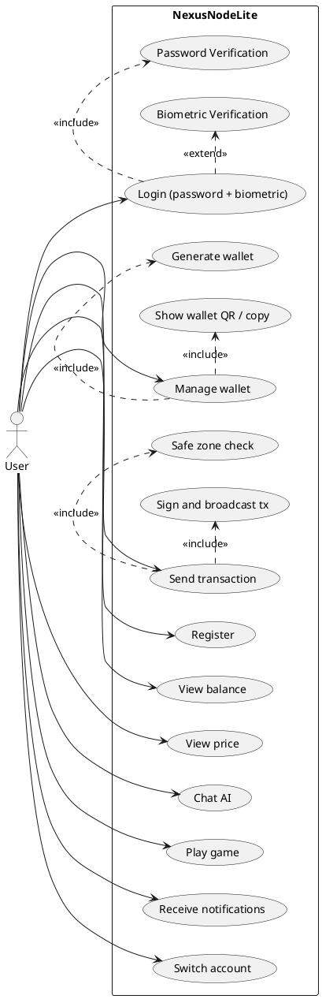

---

## 2) Activity Diagrams

### 2.1 Login flow

Explanation:

- Password is mandatory gate.
- Biometric flow branches by device capability and enrollment.
- Success path hydrates user-scoped storage and providers.

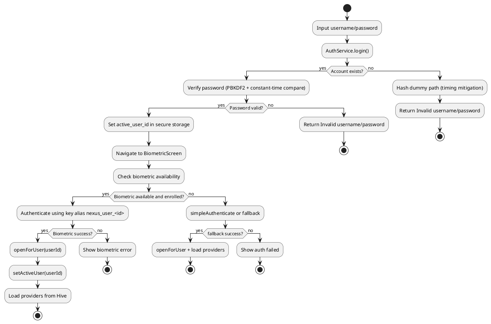

### 2.2 Send Transaction flow

Explanation:

- Transaction sending is disabled by safe-zone state in UI.
- Signing requires decrypted private key from secure storage.
- Post-send updates local history and notification.

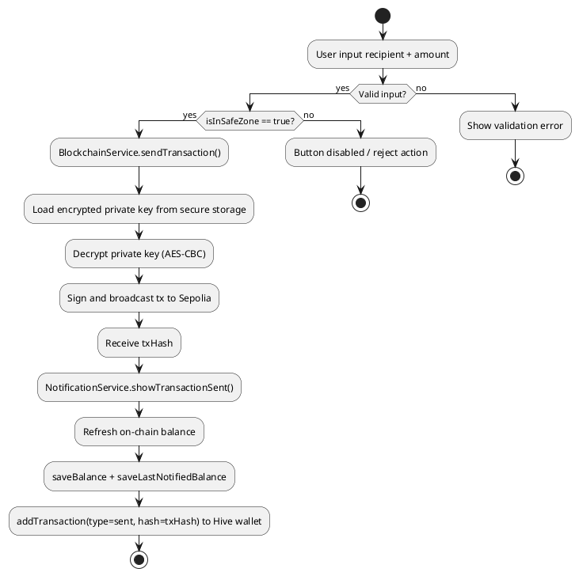

### 2.3 Receive Transaction flow (current implementation)

Explanation:

- Incoming detection is balance-delta based.
- No tx-level sender lookup is performed.

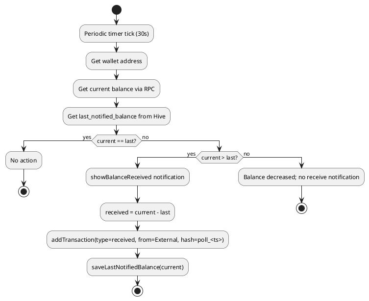

---

## 3) Class Diagram

Explanation:

- Shows service layer, storage objects, and Hive box boundaries.
- Global vs user-scoped boxes are separated.
- Security-sensitive keys stay in secure storage.

```plantuml
@startuml
skinparam classAttributeIconSize 0

class AuthService {
  - PasswordService _passwordService
  - BiometricAuthService _biometricService
  - FlutterSecureStorage _secureStorage
  - Box? _accountsBox
  + init()
  + register(username, password, enrollBiometric)
  + login(username, password)
  + loginWithBiometric(userId)
  + switchAccount(userId)
  + logout()
  + getActiveUserId()
  + getActiveUser()
  + getAllAccounts()
  + getUserById(userId)
}

class PasswordService {
  - static const int _iterations = 100000
  - static const int _bits = 256
  - static const int _saltLength = 32
  + generateSalt()
  + hashPassword(password, saltBase64)
  + verifyPassword(password, storedHash, saltBase64)
}

class BiometricAuthService {
  + checkAvailability()
  + enrollBiometric(userId)
  + authenticate(userId, challenge)
  + simpleAuthenticate()
  + hasEnrolledKeys(userId)
  + deleteKeys(userId)
}

class SecurityService {
  - FlutterSecureStorage _secureStorage
  + ensureEncryptionKeys()
  + encryptData(plainText)
  + decryptData(encryptedBase64)
  + saveSecure(key, value)
  + readSecure(key)
  + deleteSecure(key)
}

class BlockchainService {
  - SecurityService _security
  - Web3Client _client
  - String? _activeUserId
  + setActiveUser(userId)
  + clearActiveUser()
  + generateWallet()
  + getBalance(address)
  + sendTransaction(toAddress, amountInEth)
}

class NotificationService {
  - FlutterLocalNotificationsPlugin _localNotifications
  - int _nextNotificationId
  + initialize()
  + showTransactionSent(amount, toAddress, txHash)
  + showBalanceReceived(previousBalance, newBalance)
  + checkBalanceChange(currentBalance, lastNotifiedBalance)
  + showPriceAlert(oldPrice, newPrice)
  + showInactivityReminder()
}

class ApiService {
  - Dio dio
  + get(path, queryParameters, options)
  + post(path, data, options)
}

class PriceService {
  - ApiService _api
  + getEthPrice()
}

class GeminiService {
  - GenerativeModel _model
  + sendMessage(prompt)
}

class LocationService {
  + getCurrentPosition()
  + isInsideSafeZone()
}

class MotionService {
  + startListening(onShake)
  + startProximityListening(onNear, onFar)
  + stopAll()
}

class UserScopedStorage {
  - Box? _walletBox
  - Box? _chatBox
  - Box? _gameBox
  - Box? _pricesBox
  - String? _currentUserId
  + initGlobal()
  + openForUser(userId)
  + closeUserBoxes()
  + cachePrices(prices)
  + getCachedPrices()
  + saveWalletAddress(address)
  + getWalletAddress()
  + saveBalance(balance)
  + getBalance()
  + saveLastNotifiedBalance(balance)
  + getLastNotifiedBalance()
  + addTransaction(tx)
  + getTransactionHistory()
  + addChatMessage(message)
  + getChatHistory()
  + saveGameScore(score)
  + getGameScore()
}

class AccountsBox <<Hive Global>> {
  + key: userId
  + value: UserAccount map
}

class PricesBox <<Hive Global>> {
  + eth_usd: double
  + eth_idr: double
  + eth_cny: double
  + last_updated: string
}

class WalletBox <<Hive User Scoped>> {
  + address: string
  + balance: double
  + last_notified_balance: double
  + tx_history: List<Map<String,String>>
}

class ChatBox <<Hive User Scoped>> {
  + history: List<Map<String,String>>
}

class GameBox <<Hive User Scoped>> {
  + score: int
  + high_score: int
  + total_games: int
}

class UserAccount {
  + id: String
  + username: String
  + passwordHash: String
  + salt: String
  + biometricPublicKey: String?
  + createdAt: String
  + avatarBase64: String?
}

AuthService --> PasswordService
AuthService --> BiometricAuthService
AuthService --> AccountsBox
AuthService --> UserAccount
AuthService --> SecurityService : session key in secure storage

BlockchainService --> SecurityService
BlockchainService --> WalletBox

PriceService --> ApiService
PriceService --> PricesBox

GeminiService --> ChatBox : via UI + UserScopedStorage
NotificationService --> WalletBox : receive-flow context
LocationService --> WalletBox : no direct relation
MotionService --> WalletBox : no direct relation

UserScopedStorage --> PricesBox
UserScopedStorage --> WalletBox
UserScopedStorage --> ChatBox
UserScopedStorage --> GameBox
@enduml
```

---

## 4) Sequence Diagrams

### 4.1 Register

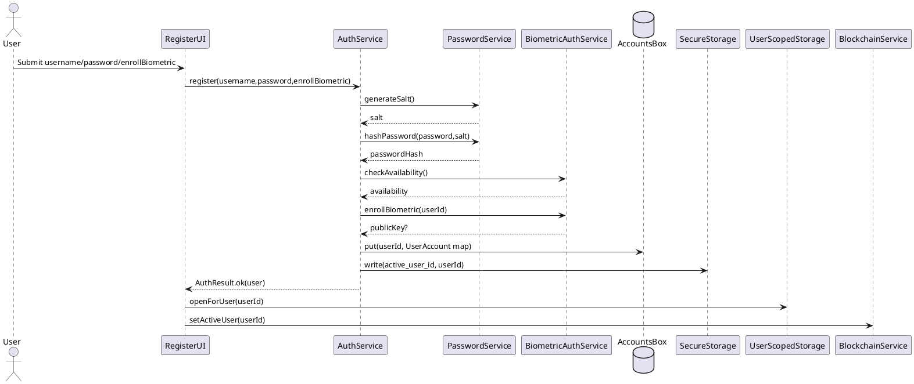

### 4.2 Login (password + biometric)

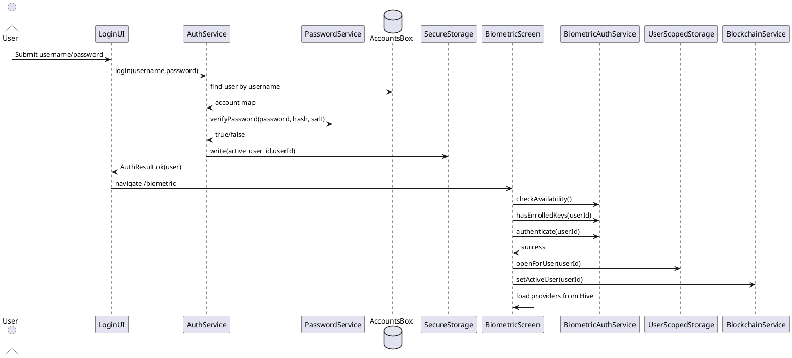

### 4.3 Manage wallet

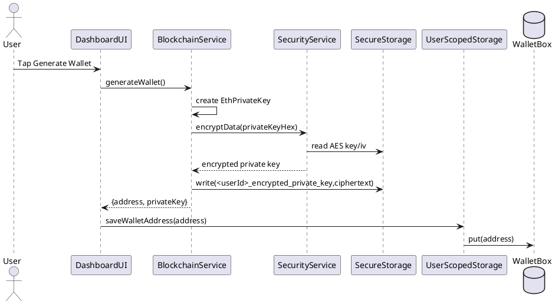

### 4.4 Send transaction

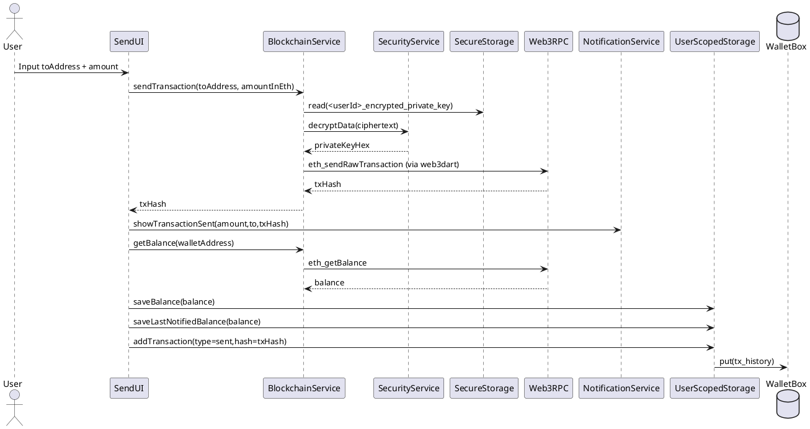

### 4.5 View balance

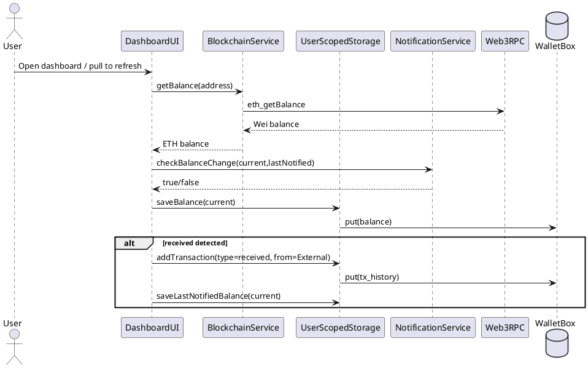

### 4.6 View price

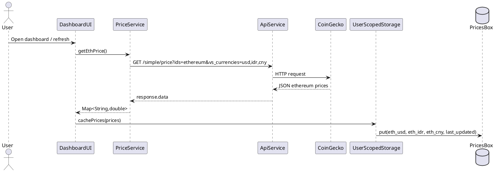

### 4.7 Chat AI

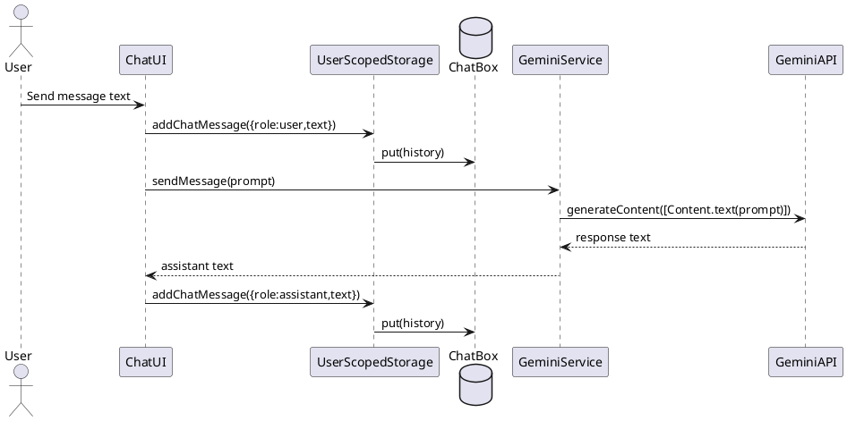

### 4.8 Play game

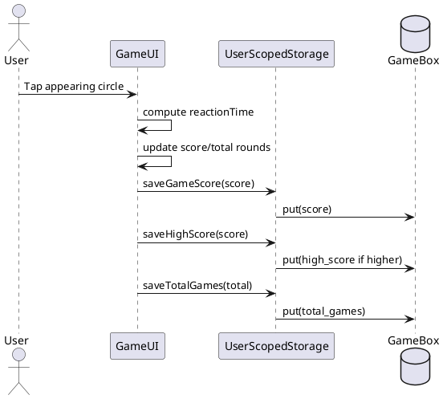

### 4.9 Receive notifications

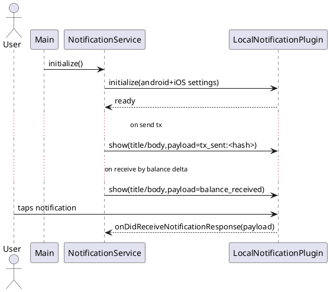

### 4.10 Switch account

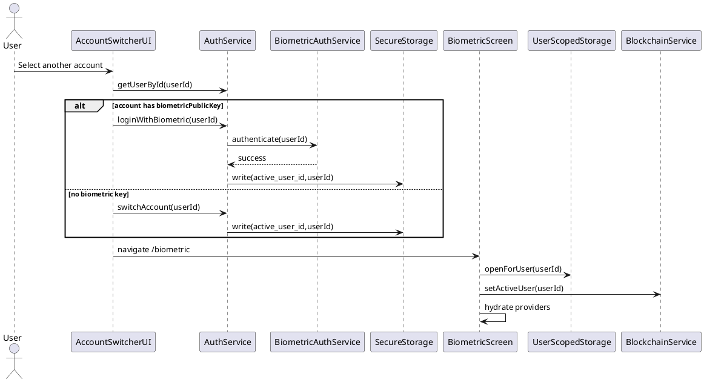

---

## Security Emphasis (Concrete)

1. Passwords are never stored plaintext.
2. Each user has unique random salt for PBKDF2.
3. Password verification uses constant-time comparison to reduce timing leakage.
4. Session anchor (`active_user_id`) is stored in secure storage, not Hive.
5. Private key is encrypted before secure storage write.
6. User data isolation is enforced by user-scoped Hive box names:
   - `user_<userId>_wallet`
   - `user_<userId>_chat`
   - `user_<userId>_game`
7. Logout closes user boxes, clears active user in blockchain service, and invalidates user-scoped providers.

---

## Scope note

All logs shown above are simulated but aligned with actual method names, data fields, and flow logic currently implemented in this workspace.
