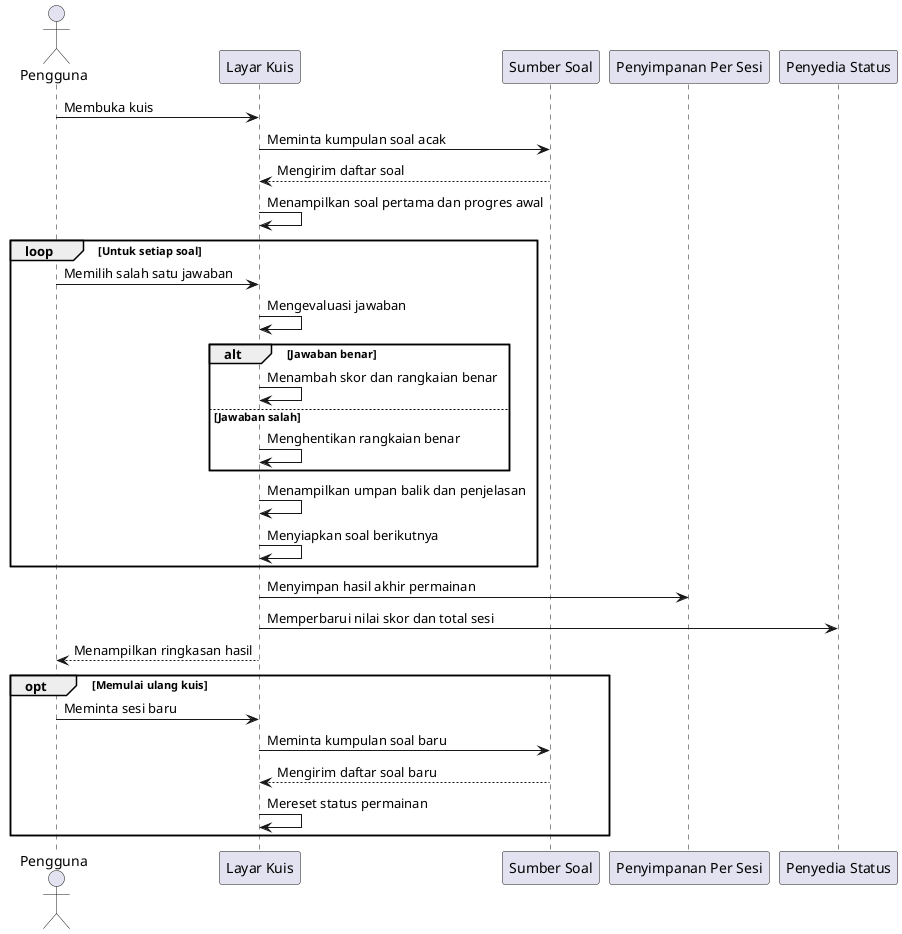
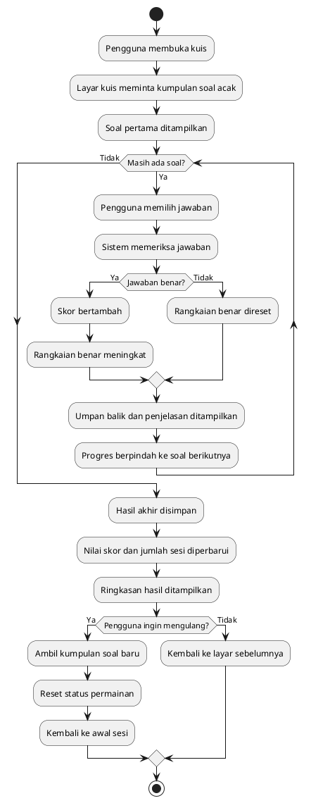

# Diagram Alur Kuis

Dokumen ini berisi diagram sequence dan activity untuk alur kuis. Istilah yang dipakai dibuat umum dan tidak menyebut nama fungsi.

## 1) Sequence Diagram

## 2) Activity Diagram

